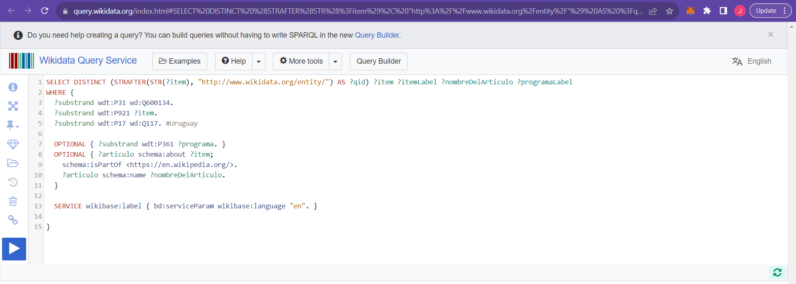
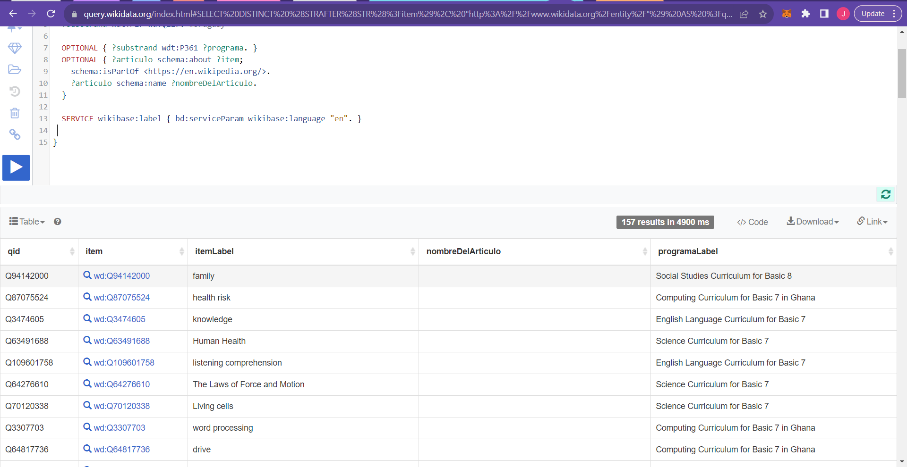

# wikicurricula-boilerplate

Interactive tool that helps visualize national curriculum data stored in Wikidata. It also shows metrics about Wikipedia articles that are relevant to the curriculum.
This is a boilerplate that will support the implementations in several countries and languages.

Credits to Wikipedia e Scuola Italiana for the original implementation.
Idea and leadership: Iolanda pensa
Web design and visualisation by Giovani Profeta - [repo](https://github.com/giovannipro/giovannipro.github.io/tree/master/wikipedia-scuola-italiana)
Work group: Federico Benvenuti, Valerio Iannucci, Luca Martinelli, Paolo Fichera
Support and collaboration: [Wikimedia Italia](https://www.wikimedia.it/)

# ⚙️ Make a Local Installation of the Wikicurricula Boilerplate on your Computer

-   Install Git (if not already installed):
    If you haven't already installed Git on your computer, you can download and install it from the official Git website: <https://git-scm.com/downloads>

-   Open a Terminal or Command Prompt:
    Depending on your OS(operating system), open a terminal window. This is where you'll run Git commands.

-   Navigate to the Directory Where You Want to Clone the Repo:
    Use the cd command to navigate to the directory where you want to create a local copy of the repository. For example:

```
    $ cd /path/to/desired/directory
```

-   Get the Clone URL:
    Go to the Wikicurricula Boilerplate GitHub repository: <https://github.com/wikicurricula-uy/wikicurricula-boilerplate>. On the repository's GitHub page, click the green "Code" button. This will reveal the clone URL. Copy the URL provided there.

-   Clone the Repository:
    Use the git clone command followed by the URL of the Git repository you want to clone. The basic syntax is: `git clone <repository-url>.git`

```
    git clone https://github.com/wikicurricula-uy/wikicurricula-boilerplate.git
```

-   Wait for Cloning to Complete:
    Git will start cloning the repository. Depending on the size of the repository and your internet connection, this may take a moment. Once the cloning process is complete, you'll see a message indicating that the repository has been cloned.

-   Navigate into the Cloned Repository:
    Use the cd command to move into the directory that was created by the git clone command: `cd repo-name` This directory will have the same name as the repository. i.e

```
    cd wikicurricula-boilerplate
```

-   Check the visuals:

    -   You can go to your file explorer and under the directory you've just created by cloning the wikicurricula-boilerplate repository, descend into the "visualization", you will find an `index.html` file. Open this file with any browser of you choice

    -   If you are using a code editor like Visual Studio Code install the "live server" extension. After installation, right click on the `index.html` file in the visualization folder and select "open with Live erver" option. This will start a server port : 5500 and a new browser window should automatically open, displaying your index.html file. The Live Server extension will serve your HTML file on a local development server with live reloading, allowing you to see changes in real-time as you edit the HTML, CSS, or JavaScript files associated with your project.

    This steps works for other visualization in the project.

# 📜How to deploy Wikicurrícula Boilerplate in Toolforge

Toolforge is simply a hosting environment for developers working on services that provide value to the Wikimedia movement. It provides web servers, data access, job management, and other features to help developers maintain tools and bots. It is a Free, reliable, and scalable cloud hosting for web services using PHP, Python, Node.js, Java, and other languages or frameworks.It also hosts continuous bots, and scheduled tasks. An example of a tool hosted on Toolforge is: `WikiTools`, a light tools for Wikipedia authors and `wordcount`, simple word counter built with Python.

## ⚡️Basic Skill Requirements

-   Basic Knowledge of some programming knowledge
-   Basic Knowledge of Unix command line
-   Basic Knowledge of SSH (SSH client like Putty or WinSCP or Linux command line)

## ⚡️Accounts Needed

A Toolforge account is required to get started. It is bascicaly creating a "Wikimedia developer account", and a "Wikimedia account".

1. `Wikimedia account`: Also known as `"Wikimedia single user login (SUL)" account`. It allows you to log into general wikis like Wikipedia, MediaWiki, and MetaWiki. Click here to create account. [Create Account](https://www.mediawiki.org/wiki/Special:CreateAccount)

2. `a Wikimedia developer account`: for access to the Toolforge project. Click the link to register. [Create Account](https://idm.wikimedia.org/signup/) or you can create a developer account through the [Toolforge admin console](Toolsadmin) if you already have a wikimedia account. Follow this steps:
    - Goto `Toolforge admin console` <https://toolsadmin.wikimedia.org/> and follow this steps:
    - Click on `Get Started`
    - You will be taken to a Toolforge-admin-console login page. Click on the `sign Up` link.
    - On the "Create a Wikimedia developer account" page, press/click the `Login using Wikimedia account` button. Enter your Wikimedia account username and password.
    - Once you're logged in, you'll be directed back to Toolsadmin. There, you'll be guided through the process of setting up an LDAP username, a UNIX shell username, and a password. Additionally, you'll be asked to provide your email address and consent to the terms of service and code of conduct specific to technical spaces.
    - Submit the form to complete creating your Wikimedia developer account.

## 🧱 Steps to deploy a tool or application(E.g Uruguay's Wikicurricula) to Toolforge

Now that you have the two(2) required accounts, follow the steps to deploy"

-   Go to the the [Toolforge admin console](https://toolsadmin.wikimedia.org/auth/login/) and log in using your LDAP username

-   Once you're logged in, Go to the settings page in Toolsadmin to link your Wikimedia and Phabricator accounts to Toolforge. You might not have a Phabricator account, create one following the directions provided on the registration page.

-   Create a new tool account / tool by clicking on the "Tools" tab to go to the tools page in Toolsadmin. If you're not a Toolforge member yet, start from step 1 but if you are, go to step 2

    1. Request Toolforge membership

    ```
    Submit a Toolforge membership request and wait for its approval.
    Your request will be reviewed, and you will receive confirmation within a week.
    You will be notified through your Wikitech user account.
    After you are added as a Toolforge member, log out and then log in again at toolsadmin.wikimedia.org.
    Doing this is required for your membership to take effect.

    ```

    After your Toolforge membership has been approved, create new tool accounts. Each individual bot, web service or other tool should have a tool account. 2. Click the "Create new tool" link at the bottom of the "Your tools" sidebar. Follow the instructions in the tool account creation form. Note the instructions below about Naming your tool. For example You can name the tool: "wikicurricula-uy" 3. After you create the tool account, log off, then log back in to access the new tool account.

-   Connect to Toolforge servers using SSH
    Currently, the only way to interact with Toolforge is through a command-line interface. If you prefer to develop using IDEs like Visual Studio Code or Eclipse, you can mount the home directory of your tool onto your local Linux machine or virtual machine (VM) Learn more at <https://wikitech.wikimedia.org/wiki/Help:Toolforge/Tool_Accounts>

    ### Set up an SSH client and a key

    -   Install an SSH client, if you do not have one already. Windows 10 (version 1803+) comes with OpenSSH built in. Popular clients include OpenSSH and PuTTY.
    -   Generate an SSH key. SSH uses public-key cryptography to securely authenticate you to the server. You can generate one by entering the following in the terminal.

    ```
        ssh-keygen -t ed25519 -C "your_email@youremail.com"
    ```

    Use the email you wish to associate with the SSH Key, and then press enter.
    When prompted Enter file in which to save the key, click enter to choose the default.
    Type a secure passphrase, and click enter.
    Retype the secure passphrase, and click enter.
    The terminal will display information about the files your identification and public key will be saved in:

    `~/.ssh/id_ed25519` - private key (as the name suggests, keep this private!)
    `~/.ssh/id_ed25519.pub` - public key
    A fingerprint and randomart image for the key will be generated.

    -   Add your public SSH key to your developer account under the settings page of the Toolforge admin console. Copy the contents of `~/.ssh/id_rsa.pub` into the New SSH Key field and click Add SSH key.

-   Log in to Toolforge

    1. Use your SSH client or terminal or command prompt to connect to Toolforge through the login.toolforge.org bastion host. Remember to use the shell username you picked when creating your Wikimedia developer account. You can check your username at toolsadmin.

    ```
    $ ssh -i <path-to-ssh-private-key> <shell-username>@login.toolforge.org
    ```

    2. On your first connection, your SSH client will ask you to verify the "fingerprint" of the server. Ensure that the fingerprint shown matches ones shown on [Help:SSH Fingerprints](https://wikitech.wikimedia.org/wiki/Help:SSH_Fingerprints).
    3. After you connect, the command prompt displays your username and the internal name of the host to which you are connected:

    `<shell-username>@tools-sgebastion-10:~$`

-   From the command line, use the `become` command to switch to the tool account for the tool you want to work on:

    ```
    $ become <toolname>
    ```

    Where "toolname" is the name you chose when creating the tool. You should see the command prompt change to:

    `tools.<toolname>@tools-sgebastion-10:~$`

-   Serving static files
    In Toolforge, tools are typically created using programming languages like Python, Node.js, or other supported options. However, when it comes to hosting a static website, there's no need to develop a specialized tool. Instead, you can leverage the web space provided by Toolforge.

    To deploy the Wikicurrícula Boilerplate on Toolforge, simply upload your files to the tool's `$HOME/www/static` directory. Once uploaded, your content will be accessible directly via the following URL: tools-static.wmflabs.org/toolname.

    No additional action is required on the tool's part—just ensure your files are placed in the designated folder and set to be readable. It should all seamlessly 'just work'.

    After switching to the tool's account, execute the following commands to upload the files for the Wikicurrícula Boilerplate into the $HOME/www/static directory of the 'wikicurricula-uy' space:

    ```
         mkdir -p $HOME/www/static
         cd $HOME/www/static
         git clone https://github.com/wikicurricula-uy/wikicurricula-boilerplate.git
    ```

A practice on migrating Uruguay's Wikicurricula from it's current hosting (Github Pages) to Toolforge was done and can be found at: <https://tools-static.wmflabs.org/wikicurricula-uy/wikicurricula-uy.github.io/index.html>

# Documentation on how to feed the visualization with data from a new curriculum

This is a detailed step-by-step guide on how to feed the visualization with data from a new curriculum.
Before going into that, you'll need to learn how to build and run the Wikidata query.

## Building and running the Ghana curriculum wikidata query

-   Obtain the wikidata query. This has already been provided [here](https://w.wiki/7Zge).

-   When it opens up, you'll see a page as shown in the image below:
    
    This wikidata curriculum provides the SPARQL to extract structured data and the Wikidata Query needed to retrieve the specific curriculum data has already been provided. Now, you'll need to execute the query.

-   To execute the query, click on the 'run' button/icon on the left-hand sidebar of the page. This will retrieve and display the curriculum data in tabular format at the bottom of the page, like so:
    
    NB: Tabular format is the default format for displaying the data but it can also be displayed in other formats like Graph builder, Line chart, Bar chart, Area chart, tree map, and so on. To change the display form, click on the "Table" dropdown located at the header of the terminal the data is being displayed in. Select the format you want it displayed in.

-   After executing the query and retriveing the data, you can download or export the results in vaious formats like JSON, CSV, TSV, or HTML. Click on the "Download" dropdown located at the header of the table format where the curriculum data is being displayed. Select the "CSV file" option and wait for it to download.

-   Rename it if you must and then import it into the 'data-gathering' folder of wikicurricula-boilerplate project in your editor.

## Feeding the Visualization with Data from the New Curriculum

# 📜How to Implement - and deploy at Toolforge - Wikicurricula for Ghana's national curriculum, with reference to the English Wikipedia

One of goals of Wikimedia is to enhance the educational experience of students by making sure that the information available on platforms like Wikicurricula corresponds to what students are studying in their classrooms, fostering a harmonious and supportive learning environment. To do so, Wikimedia stores schools' curricula data in a large database called Wikidata and then allows students, editors,teachers to interact with the data through an interface known as Wikicurricula.

Indeed the project was successful in Ghana and replicated in Uruguay. However, Wikicurricula's user interface isn't friendly to use. Therefore, Wikimedia allows developers to create tools such as apps, websites, bots, search functionalities, etc, in order to improve user experience. This documentation details steps taken to implement and deploy Ghana's national curriculum to Toolforge. You can adjust it to any curricula but adjust according to your curricula.

### Required Skills

Before proceeding, understand these:

-   [Wikidata](https://www.wikidata.org/wiki/Wikidata:Introduction)
-   [SPARQL](https://www.wikidata.org/wiki/Wikidata:SPARQL_tutorial)
-   [Toolforge](https://github.com/wikicurricula-uy/wikicurricula-boilerplate#%EF%B8%8Faccounts-needed)

1. Visit the Wikidata Query Service
   Go to https://query.wikidata.org/

2. Paste the Query
   Copy the provided SPARQL query. for example Ghana's curriculum query: https://w.wiki/7Zge
   Paste the query into the text area on the Wikidata Query Service page.
   Click the "Run" button to execute the query.

3. Understand the results
   The results of the query will be displayed below the query editor. You'll see a table with columns corresponding to the variables in the SELECT clause.

4. Export or Save Results (Optional)
   You may have options to export or save the results, depending on the features provided by the query service interface and your tool.

5. Adjust Query
   Adjust the query or explore the results to suit your specific needs. You can also modify the conditions in the WHERE clause to refine the scope of your search. Now you can begin writing code for your tool.

6. Code Setup

-   Create a new repository for your Wikicurricula project.

-   Run:

```
         git clone https://github.com/wikicurricula-uy/wikicurricula-boilerplate.git
```

-   Open the repo in your text editor.
-   In your command line, move to the data-gathering folder and run the query.py script.

```
    python query.py
    python bot.py
```

-   Change translate.py so that it can work with results.txt instead of resultati.txt
-   Change translate.py so that it can work with 'visualization/assets/data/voci_2023.tsv' instead of 'data-gathering/voci_2023.tsv'
-   Move to the visualization folder.
    -   Move to the script folder and change dv1.js from https://es.wikipedia.org/wiki/ to "https://en.wikipedia.org/wiki/"
    *   Change subjects variable in utilities.js to the subjects in subjects.csv
    *   Change the legends colour and labels in utilities.js
    *   Change the legends in img folder

7. Test the curricula
   Before making the curricula publicly accessible, test it thoroughly to ensure it works as expected.

8. Push your code to Github

9. Make the curricula public
   Once you're confident in your tool's functionality, you can make it public on Toolforge.

### Deploy the curricula on Toolforge

1. Use this guide to deploy the curricula to Toolforge. https://github.com/wikicurricula-uy/wikicurricula-boilerplate#how-to-deploy-wikicurr%C3%ADcula-boilerplate-in-toolforge

Here is [Ghana's national curricula](https://tools-static.wmflabs.org/ghana-national-curriculum/GhanaWikiCurricula/visualization/) on Toolforge.

# 📜How to fetch the list of articles from Wikidata API

### DEMO - fetching articles related to Ghana's curriculum

```
    import csv
import requests


# make a request to wikidata API to fetch Ghana's curriculum
def fetch_wikidata_info():
    # Wikidata endpoint URL for the SPARQL query
    wikidata_endpoint = "https://query.wikidata.org/sparql"


# wikicurricula-boilerplate
Interactive tool that helps visualize national curriculum data stored in Wikidata. It also shows metrics about Wikipedia articles that are relevant to the curriculum.
This is a boilerplate that will support the implementations in several countries and languages.

Credits to Wikipedia e Scuola Italiana for the original implementation.
Idea and leadership: Iolanda pensa
Web design and visualisation by Giovani Profeta - [repo](https://github.com/giovannipro/giovannipro.github.io/tree/master/wikipedia-scuola-italiana)
Work group: Federico Benvenuti, Valerio Iannucci, Luca Martinelli, Paolo Fichera
Support and collaboration: [Wikimedia Italia](https://www.wikimedia.it/)

# ⚙️ Make a Local Installation of the Wikicurricula Boilerplate on your Computer

- Install Git (if not already installed):
If you haven't already installed Git on your computer, you can download and install it from the official Git website: <https://git-scm.com/downloads>

- Open a Terminal or Command Prompt:
Depending on your OS(operating system), open a terminal window. This is where you'll run Git commands.

- Navigate to the Directory Where You Want to Clone the Repo:
Use the cd command to navigate to the directory where you want to create a local copy of the repository. For example:
```
    $ cd /path/to/desired/directory
```
- Get the Clone URL:
Go to the Wikicurricula Boilerplate GitHub repository: <https://github.com/wikicurricula-uy/wikicurricula-boilerplate>. On the repository's GitHub page, click the green "Code" button. This will reveal the clone URL. Copy the URL provided there.

- Clone the Repository:
Use the git clone command followed by the URL of the Git repository you want to clone. The basic syntax is: `git clone <repository-url>.git`
```
    git clone https://github.com/wikicurricula-uy/wikicurricula-boilerplate.git
```
- Wait for Cloning to Complete:
Git will start cloning the repository. Depending on the size of the repository and your internet connection, this may take a moment. Once the cloning process is complete, you'll see a message indicating that the repository has been cloned.

- Navigate into the Cloned Repository:
Use the cd command to move into the directory that was created by the git clone command: `cd repo-name` This directory will have the same name as the repository. i.e 
```
    cd wikicurricula-boilerplate
```

- Check the visuals:
    - You can go to your file explorer and under the directory you've just created by cloning the wikicurricula-boilerplate repository, descend into the "visualization", you will find an `index.html` file. Open this file with any browser of you choice

    - If you are using a code editor like Visual Studio Code install the "live server" extension. After installation, right click on the `index.html` file in the visualization folder and select "open with Live erver" option. This will start a server port : 5500 and a new browser window should automatically open, displaying your index.html file. The Live Server extension will serve your HTML file on a local development server with live reloading, allowing you to see changes in real-time as you edit the HTML, CSS, or JavaScript files associated with your project.

    This steps works for other visualization in the project.

# 💡 How to contribute to this project(make a Pull Request (PR) to this GitHub repository)

- Create a GitHub Account:
If you don't already have a GitHub account, go to the [GitHub website](https://github.com/) and sign up for a free account.

- Fork the Repository:
Click the "Fork" button at the top right corner of this repository's page. This will create a copy (fork) of the repository under your GitHub account.

- Clone Your Fork:
    - On your forked repository's page, click the "Code" button, and then copy the repository's URL.

    - Open your terminal/command prompt and navigate to the directory where you want to clone the repository using the cd command
    - Use the git clone command to clone the repository to your local machine: replacing "repository_url" with your fork URL you copied:

    ```
        git clone wikicurricula-boilerplate.git
    ```

- Create a New Branch: 
    - Change directory into the newly cloned repository directory using cd command. `cd wikicurricula-boilerplate`
    - Create a new branch for your changes and switch into the new branch with the command: `git checkout -b`. 
    For example:
    ```
        git checkout -b fixing-the-footer-branch
    ```
    It's a good practice to give it a descriptive name that indicates the purpose of your changes. Semantic branching is also a good practice

- Make Changes:
Make the necessary code changes or additions in your branch using your preferred code editor.

- Stage changes and Commit the changes with a meaningful commit message: 
for example
```
    git add .
    git commit -m "Added a new feature" 

```
- Push Changes to Your Fork:
Push your branch to your forked repository on GitHub with the command: `git push origin <branch-name`

```
    git push origin fixing-the-footer-branch
```
- Create a Pull Request (PR):
    - Go to your forked repository on GitHub. You will notice a notification banner, signifying that you have recently pushed a new branch. Click on the "Compare & pull request" button.
    - Review the PR. Ensure to provide a title and description to explain your changes.If everything appears satisfactory, proceed to Submitting the PR by clicking the "Create pull request" button


# 📜How to deploy Wikicurrícula Boilerplate in Toolforge

Toolforge is simply a hosting environment for developers working on services that provide value to the Wikimedia movement. It provides web servers, data access, job management, and other features to help developers maintain tools and bots. It is a Free, reliable, and scalable cloud hosting for web services using PHP, Python, Node.js, Java, and other languages or frameworks.It also hosts continuous bots, and scheduled tasks. An example of a tool hosted on Toolforge is: `WikiTools`, a light tools for Wikipedia authors and  `wordcount`, simple word counter built with Python.

## ⚡️Basic Skill Requirements

- Basic Knowledge of some programming knowledge
- Basic Knowledge of Unix command line
- Basic Knowledge of SSH (SSH client like Putty or WinSCP or Linux command line)

## ⚡️Accounts Needed

A Toolforge account is required to get started. It is bascicaly creating a "Wikimedia developer account", and a "Wikimedia account".

1. `Wikimedia account`:	Also known as `"Wikimedia single user login (SUL)" account`. It allows you to log into general wikis like Wikipedia, MediaWiki, and MetaWiki. Click here to create account. [Create Account](https://www.mediawiki.org/wiki/Special:CreateAccount)

2. `a Wikimedia developer account`: for access to the Toolforge project. Click the link to register. [Create Account](https://idm.wikimedia.org/signup/) or you can create a developer account through the [Toolforge admin console](Toolsadmin) if you already have a wikimedia account. Follow this steps:
    - Goto `Toolforge admin console` <https://toolsadmin.wikimedia.org/> and follow this steps:
    - Click on `Get Started`
    - You will be taken to a  Toolforge-admin-console login page. Click on the `sign Up` link. 
    - On the "Create a Wikimedia developer account" page, press/click the `Login using Wikimedia account` button. Enter your Wikimedia account username and password.
    - Once you're logged in, you'll be directed back to Toolsadmin. There, you'll be guided through the process of setting up an LDAP username, a UNIX shell username, and a password. Additionally, you'll be asked to provide your email address and consent to the terms of service and code of conduct specific to technical spaces.
    - Submit the form to complete creating your Wikimedia developer account.

## 🧱 Steps to deploy a tool or application(E.g Uruguay's Wikicurricula) to Toolforge

Now that you have the two(2) required accounts, follow the steps to deploy"
- Go to the the [Toolforge admin console](https://toolsadmin.wikimedia.org/auth/login/) and log in using your LDAP username

- Once you're logged in, Go to the settings page in Toolsadmin to link your Wikimedia and Phabricator accounts to Toolforge. You might not have a Phabricator account, create one following the directions provided on the registration page.


- Create a new tool account / tool by clicking on the "Tools" tab to go to the tools page in Toolsadmin. If you're not a Toolforge member yet, start from step 1 but if you are, go to step 2
    1. Request Toolforge membership
    ```
    Submit a Toolforge membership request and wait for its approval.
    Your request will be reviewed, and you will receive confirmation within a week. 
    You will be notified through your Wikitech user account.
    After you are added as a Toolforge member, log out and then log in again at toolsadmin.wikimedia.org. 
    Doing this is required for your membership to take effect.

    ```
    After your Toolforge membership has been approved, create new tool accounts. Each individual bot, web service or other tool should have a tool account.
    2. Click the "Create new tool" link at the bottom of the "Your tools" sidebar. Follow the instructions in the tool account creation form. Note the instructions below about Naming your tool. For example You can name the tool: "wikicurricula-uy"
    3. After you create the tool account, log off, then log back in to access the new tool account.

- Connect to Toolforge servers using SSH 
    Currently, the only way to interact with Toolforge is through a command-line interface. If you prefer to develop using IDEs like Visual Studio Code or Eclipse, you can mount the home directory of your tool onto your local Linux machine or virtual machine (VM) Learn more at <https://wikitech.wikimedia.org/wiki/Help:Toolforge/Tool_Accounts>

    ### Set up an SSH client and a key
    - Install an SSH client, if you do not have one already. Windows 10 (version 1803+) comes with OpenSSH built in. Popular clients include OpenSSH and PuTTY.
    - Generate an SSH key. SSH uses public-key cryptography to securely authenticate you to the server. You can generate one by entering the following in the terminal. 
    ```
        ssh-keygen -t ed25519 -C "your_email@youremail.com"
    ```
    Use the email you wish to associate with the SSH Key, and then press enter.
    When prompted Enter file in which to save the key, click enter to choose the default.
    Type a secure passphrase, and click enter.
    Retype the secure passphrase, and click enter.
    The terminal will display information about the files your identification and public key will be saved in:

    `~/.ssh/id_ed25519` - private key (as the name suggests, keep this private!)
    `~/.ssh/id_ed25519.pub` - public key
    A fingerprint and randomart image for the key will be generated.


    - Add your public SSH key to your developer account under the settings page of the Toolforge admin console. Copy the contents of `~/.ssh/id_rsa.pub` into the New SSH Key field and click Add SSH key.

- Log in to Toolforge
    1. Use your SSH client or terminal or command prompt to connect to Toolforge through the login.toolforge.org bastion host. Remember to use the shell username you picked when creating your Wikimedia developer account. You can check your username at toolsadmin.

    ``` 
    $ ssh -i <path-to-ssh-private-key> <shell-username>@login.toolforge.org 
    ```

    2. On your first connection, your SSH client will ask you to verify the "fingerprint" of the server. Ensure that the fingerprint shown matches ones shown on [Help:SSH Fingerprints](https://wikitech.wikimedia.org/wiki/Help:SSH_Fingerprints).
    3. After you connect, the command prompt displays your username and the internal name of the host to which you are connected:
    
    `<shell-username>@tools-sgebastion-10:~$`

- From the command line, use the `become` command to switch to the tool account for the tool you want to work on:
    ```
    $ become <toolname>
    ```
    Where "toolname" is the name you chose when creating the tool. You should see the command prompt change to:

    `tools.<toolname>@tools-sgebastion-10:~$`


- Serving static files
    In Toolforge, tools are typically created using programming languages like Python, Node.js, or other supported options. However, when it comes to hosting a static website, there's no need to develop a specialized tool. Instead, you can leverage the web space provided by Toolforge.

    To deploy the Wikicurrícula Boilerplate on Toolforge, simply upload your files to the tool's `$HOME/www/static` directory. Once uploaded, your content will be accessible directly via the following URL: tools-static.wmflabs.org/toolname. 

    No additional action is required on the tool's part—just ensure your files are placed in the designated folder and set to be readable. It should all seamlessly 'just work'.

    After switching to the tool's account, execute the following commands to upload the files for the Wikicurrícula Boilerplate into the $HOME/www/static directory of the 'wikicurricula-uy' space:
    ```
         mkdir -p $HOME/www/static
         cd $HOME/www/static
         git clone https://github.com/wikicurricula-uy/wikicurricula-boilerplate.git
    ```


A practice on migrating Uruguay's Wikicurricula from it's current hosting (Github Pages) to Toolforge was doen and can be found at: <https://tools-static.wmflabs.org/wikicurricula-uy/wikicurricula-uy.github.io/index.html>


# wikicurricula-boilerplate
Interactive tool that helps visualize national curriculum data stored in Wikidata. It also shows metrics about Wikipedia articles that are relevant to the curriculum.
This is a boilerplate that will support the implementations in several countries and languages.

Credits to Wikipedia e Scuola Italiana for the original implementation.
Idea and leadership: Iolanda pensa
Web design and visualisation by Giovani Profeta - [repo](https://github.com/giovannipro/giovannipro.github.io/tree/master/wikipedia-scuola-italiana)
Work group: Federico Benvenuti, Valerio Iannucci, Luca Martinelli, Paolo Fichera
Support and collaboration: [Wikimedia Italia](https://www.wikimedia.it/)

# ⚙️ Make a Local Installation of the Wikicurricula Boilerplate on your Computer

- Install Git (if not already installed):
If you haven't already installed Git on your computer, you can download and install it from the official Git website: <https://git-scm.com/downloads>

- Open a Terminal or Command Prompt:
Depending on your OS(operating system), open a terminal window. This is where you'll run Git commands.

- Navigate to the Directory Where You Want to Clone the Repo:
Use the cd command to navigate to the directory where you want to create a local copy of the repository. For example:
```
    $ cd /path/to/desired/directory
```
- Get the Clone URL:
Go to the Wikicurricula Boilerplate GitHub repository: <https://github.com/wikicurricula-uy/wikicurricula-boilerplate>. On the repository's GitHub page, click the green "Code" button. This will reveal the clone URL. Copy the URL provided there.

- Clone the Repository:
Use the git clone command followed by the URL of the Git repository you want to clone. The basic syntax is: `git clone <repository-url>.git`
```
    git clone https://github.com/wikicurricula-uy/wikicurricula-boilerplate.git
```
- Wait for Cloning to Complete:
Git will start cloning the repository. Depending on the size of the repository and your internet connection, this may take a moment. Once the cloning process is complete, you'll see a message indicating that the repository has been cloned.

- Navigate into the Cloned Repository:
Use the cd command to move into the directory that was created by the git clone command: `cd repo-name` This directory will have the same name as the repository. i.e 
```
    cd wikicurricula-boilerplate
```

- Check the visuals:
    - You can go to your file explorer and under the directory you've just created by cloning the wikicurricula-boilerplate repository, descend into the "visualization", you will find an `index.html` file. Open this file with any browser of you choice

    - If you are using a code editor like Visual Studio Code install the "live server" extension. After installation, right click on the `index.html` file in the visualization folder and select "open with Live erver" option. This will start a server port : 5500 and a new browser window should automatically open, displaying your index.html file. The Live Server extension will serve your HTML file on a local development server with live reloading, allowing you to see changes in real-time as you edit the HTML, CSS, or JavaScript files associated with your project.

    This steps works for other visualization in the project.

# 💡 How to contribute to this project(make a Pull Request (PR) to this GitHub repository)

- Create a GitHub Account:
If you don't already have a GitHub account, go to the [GitHub website](https://github.com/) and sign up for a free account.

- Fork the Repository:
Click the "Fork" button at the top right corner of this repository's page. This will create a copy (fork) of the repository under your GitHub account.

- Clone Your Fork:
    - On your forked repository's page, click the "Code" button, and then copy the repository's URL.

    - Open your terminal/command prompt and navigate to the directory where you want to clone the repository using the cd command
    - Use the git clone command to clone the repository to your local machine: replacing "repository_url" with your fork URL you copied:

    ```
        git clone wikicurricula-boilerplate.git
    ```

- Create a New Branch: 
    - Change directory into the newly cloned repository directory using cd command. `cd wikicurricula-boilerplate`
    - Create a new branch for your changes and switch into the new branch with the command: `git checkout -b`. 
    For example:
    ```
        git checkout -b fixing-the-footer-branch
    ```
    It's a good practice to give it a descriptive name that indicates the purpose of your changes. Semantic branching is also a good practice

- Make Changes:
Make the necessary code changes or additions in your branch using your preferred code editor.

- Stage changes and Commit the changes with a meaningful commit message: 
for example
```
    git add .
    git commit -m "Added a new feature" 

```
- Push Changes to Your Fork:
Push your branch to your forked repository on GitHub with the command: `git push origin <branch-name`

```
    git push origin fixing-the-footer-branch
```
- Create a Pull Request (PR):
    - Go to your forked repository on GitHub. You will notice a notification banner, signifying that you have recently pushed a new branch. Click on the "Compare & pull request" button.
    - Review the PR. Ensure to provide a title and description to explain your changes.If everything appears satisfactory, proceed to Submitting the PR by clicking the "Create pull request" button


# 📜How to deploy Wikicurrícula Boilerplate in Toolforge

Toolforge is simply a hosting environment for developers working on services that provide value to the Wikimedia movement. It provides web servers, data access, job management, and other features to help developers maintain tools and bots. It is a Free, reliable, and scalable cloud hosting for web services using PHP, Python, Node.js, Java, and other languages or frameworks.It also hosts continuous bots, and scheduled tasks. An example of a tool hosted on Toolforge is: `WikiTools`, a light tools for Wikipedia authors and  `wordcount`, simple word counter built with Python.

## ⚡️Basic Skill Requirements

- Basic Knowledge of some programming knowledge
- Basic Knowledge of Unix command line
- Basic Knowledge of SSH (SSH client like Putty or WinSCP or Linux command line)

## ⚡️Accounts Needed

A Toolforge account is required to get started. It is bascicaly creating a "Wikimedia developer account", and a "Wikimedia account".

1. `Wikimedia account`:	Also known as `"Wikimedia single user login (SUL)" account`. It allows you to log into general wikis like Wikipedia, MediaWiki, and MetaWiki. Click here to create account. [Create Account](https://www.mediawiki.org/wiki/Special:CreateAccount)

2. `a Wikimedia developer account`: for access to the Toolforge project. Click the link to register. [Create Account](https://idm.wikimedia.org/signup/) or you can create a developer account through the [Toolforge admin console](Toolsadmin) if you already have a wikimedia account. Follow this steps:
    - Goto `Toolforge admin console` <https://toolsadmin.wikimedia.org/> and follow this steps:
    - Click on `Get Started`
    - You will be taken to a  Toolforge-admin-console login page. Click on the `sign Up` link. 
    - On the "Create a Wikimedia developer account" page, press/click the `Login using Wikimedia account` button. Enter your Wikimedia account username and password.
    - Once you're logged in, you'll be directed back to Toolsadmin. There, you'll be guided through the process of setting up an LDAP username, a UNIX shell username, and a password. Additionally, you'll be asked to provide your email address and consent to the terms of service and code of conduct specific to technical spaces.
    - Submit the form to complete creating your Wikimedia developer account.

## 🧱 Steps to deploy a tool or application(E.g Uruguay's Wikicurricula) to Toolforge

Now that you have the two(2) required accounts, follow the steps to deploy"
- Go to the the [Toolforge admin console](https://toolsadmin.wikimedia.org/auth/login/) and log in using your LDAP username

- Once you're logged in, Go to the settings page in Toolsadmin to link your Wikimedia and Phabricator accounts to Toolforge. You might not have a Phabricator account, create one following the directions provided on the registration page.


- Create a new tool account / tool by clicking on the "Tools" tab to go to the tools page in Toolsadmin. If you're not a Toolforge member yet, start from step 1 but if you are, go to step 2
    1. Request Toolforge membership
    ```
    Submit a Toolforge membership request and wait for its approval.
    Your request will be reviewed, and you will receive confirmation within a week. 
    You will be notified through your Wikitech user account.
    After you are added as a Toolforge member, log out and then log in again at toolsadmin.wikimedia.org. 
    Doing this is required for your membership to take effect.

    ```
    After your Toolforge membership has been approved, create new tool accounts. Each individual bot, web service or other tool should have a tool account.
    2. Click the "Create new tool" link at the bottom of the "Your tools" sidebar. Follow the instructions in the tool account creation form. Note the instructions below about Naming your tool. For example You can name the tool: "wikicurricula-uy"
    3. After you create the tool account, log off, then log back in to access the new tool account.

- Connect to Toolforge servers using SSH 
    Currently, the only way to interact with Toolforge is through a command-line interface. If you prefer to develop using IDEs like Visual Studio Code or Eclipse, you can mount the home directory of your tool onto your local Linux machine or virtual machine (VM) Learn more at <https://wikitech.wikimedia.org/wiki/Help:Toolforge/Tool_Accounts>

    ### Set up an SSH client and a key
    - Install an SSH client, if you do not have one already. Windows 10 (version 1803+) comes with OpenSSH built in. Popular clients include OpenSSH and PuTTY.
    - Generate an SSH key. SSH uses public-key cryptography to securely authenticate you to the server. You can generate one by entering the following in the terminal. 
    ```
        ssh-keygen -t ed25519 -C "your_email@youremail.com"
    ```
    Use the email you wish to associate with the SSH Key, and then press enter.
    When prompted Enter file in which to save the key, click enter to choose the default.
    Type a secure passphrase, and click enter.
    Retype the secure passphrase, and click enter.
    The terminal will display information about the files your identification and public key will be saved in:

    `~/.ssh/id_ed25519` - private key (as the name suggests, keep this private!)
    `~/.ssh/id_ed25519.pub` - public key
    A fingerprint and randomart image for the key will be generated.


    - Add your public SSH key to your developer account under the settings page of the Toolforge admin console. Copy the contents of `~/.ssh/id_rsa.pub` into the New SSH Key field and click Add SSH key.

- Log in to Toolforge
    1. Use your SSH client or terminal or command prompt to connect to Toolforge through the login.toolforge.org bastion host. Remember to use the shell username you picked when creating your Wikimedia developer account. You can check your username at toolsadmin.

    ``` 
    $ ssh -i <path-to-ssh-private-key> <shell-username>@login.toolforge.org 
    ```

    2. On your first connection, your SSH client will ask you to verify the "fingerprint" of the server. Ensure that the fingerprint shown matches ones shown on [Help:SSH Fingerprints](https://wikitech.wikimedia.org/wiki/Help:SSH_Fingerprints).
    3. After you connect, the command prompt displays your username and the internal name of the host to which you are connected:
    
    `<shell-username>@tools-sgebastion-10:~$`

- From the command line, use the `become` command to switch to the tool account for the tool you want to work on:
    ```
    $ become <toolname>
    ```
    Where "toolname" is the name you chose when creating the tool. You should see the command prompt change to:

    `tools.<toolname>@tools-sgebastion-10:~$`


- Serving static files
    In Toolforge, tools are typically created using programming languages like Python, Node.js, or other supported options. However, when it comes to hosting a static website, there's no need to develop a specialized tool. Instead, you can leverage the web space provided by Toolforge.

    To deploy the Wikicurrícula Boilerplate on Toolforge, simply upload your files to the tool's `$HOME/www/static` directory. Once uploaded, your content will be accessible directly via the following URL: tools-static.wmflabs.org/toolname. 

    No additional action is required on the tool's part—just ensure your files are placed in the designated folder and set to be readable. It should all seamlessly 'just work'.

    After switching to the tool's account, execute the following commands to upload the files for the Wikicurrícula Boilerplate into the $HOME/www/static directory of the 'wikicurricula-uy' space:
    ```
         mkdir -p $HOME/www/static
         cd $HOME/www/static
         git clone https://github.com/wikicurricula-uy/wikicurricula-boilerplate.git
    ```


A practice on migrating Uruguay's Wikicurricula from it's current hosting (Github Pages) to Toolforge was doen and can be found at: <https://tools-static.wmflabs.org/wikicurricula-uy/wikicurricula-uy.github.io/index.html>


# 🧱 How to fetch the list of articles from Wikidata API 
To fetch a list of articles from the Wikidata API, you can use the Wikidata Query Service (WDQS) or make direct API requests to Wikidata's REST API. Learn more about Wikidata [here](https://www.wikidata.org/wiki/Wikidata:Introduction)

- ## Using the Wikidata Query Service (WDQS): 
    This is method is quite a convenient way to query Wikidata for structured data.
    - Open your web browser and go to the Wikidata Query Service website: <https://query.wikidata.org/>.

    - You can use SPARQL (SPARQL Protocol and RDF Query Language, pronounce as 'sparkle') to query Wikidata. Just like SQL allows users to retrieve and modify data in a relational database, SPARQL provides the same functionality for NoSQL graph databases. Here's a simple example of a SPARQL query to fetch a list of articles (items) from Wikidata:
    ```
        SELECT ?child ?childLabel
        WHERE{
            ?child wdt:P22 wd:Q1339;
                wdt:P25 wd:Q57487;
                wdt:P106 wd:Q36834;
                wdt:P106 wd:Q486748.
            SERVICE wikibase:label { bd:serviceParam wikibase:language "[AUTO_LANGUAGE]". }
        }

    ```
    NB: For simple WDQS triples, items should be prefixed with wd:, and properties with wdt.
    Learn more about SPARQL [here](https://www.wikidata.org/wiki/Wikidata:SPARQL_tutorial)

    - Click the "Run" button to execute the query. You'll see the list of articles displayed in the query results.

    - You can also export the results in different formats like JSON, CSV, or RDF by clicking on the "Download" button.


- ## Using the Wikidata API directly:
    If you want to fetch data programmatically, you can make direct HTTP requests to the Wikidata API. Here's a simplified example using Python's requests library:

    ```
        import requests # Install this library using this command: "pip install requests"

        # Define the API endpoint
        wikidata_endpoint = "https://www.wikidata.org/w/api.php"

        # Define query parameters
        params = {
            "action": "wbsearchentities",
            "format": "json",
            "language": "en",
            "type": "item",
            "props": "info|labels",
            "limit": 100,
            "search": "haswbstatement:P31=Q13442814"  # Filter items that are articles,
        }

        # Make the API request
        response = requests.get(api_url, params=params)
        data = response.json()

        # Extract and print the list of articles
        articles = data.get("search", [])
        for article in articles:
            print(article["id"], article["label"])
            
    ```

    In this Python script, we're using the wbsearchentities action to search for Wikidata entities (items). You can adjust the parameters to filter results based on your specific criteria. Additionally, you can refer to the Wikidata API documentation for more details on available endpoints and query options: <https://www.wikidata.org/w/api.php>


    
    Another example:

    ```
        import requests
        import csv
        import json


        # Define your SPARQL query
        sparql_query = f"""
        SELECT DISTINCT (STRAFTER(STR(?item), "http://www.wikidata.org/entity/") AS ?qid) ?item ?itemLabel ?articleName ?programLabel
        WHERE {{
            ?substrand wdt:P31 wd:Q600134.
            ?substrand wdt:P921 ?item.
            ?substrand wdt:P17 wd:Q77. #Uruguay
            
            OPTIONAL {{ ?substrand wdt:P361 ?program. }}
            OPTIONAL {{ ?articulo schema:about ?item;
                schema:isPartOf <https://{language_code}.wikipedia.org/>. 
                ?articulo schema:name ?articleName.
            }}
            
            SERVICE wikibase:label {{ bd:serviceParam wikibase:language "{language_code}". }}
        }}
        """

        # Define the Wikidata Query Service endpoint URL
        wikidata_endpoint = "https://query.wikidata.org/sparql"

        # Define headers for the HTTP request
        headers = {
            "User-Agent": "Python SPARQL Client",
            "Accept": "application/sparql-results+json",
        }

        # Define the query parameters
        params = {
            "query": sparql_query,
            "format": "json",
        }

        try:
            # Send a GET request to the Wikidata Query Service endpoint
            response = requests.get(wikidata_endpoint, headers=headers, params=params)

            if response.status_code == 200:
                data = json.loads(response.text)

                if "results" in data:
                    # Extract and save the results to a CSV file
                    with open("query_result.csv", mode="w", newline="", encoding="utf-8") as csv_file:
                        csv_writer = csv.writer(csv_file)


                        csv_writer.writerow(["qid", "item", "itemLabel", "articleName", "programLabel"])

                        
                        for item in data["results"]["bindings"]:
                            qid = item.get("qid", {}).get("value", "")  # Handle missing qid
                            item_uri = item.get("item", {}).get("value", "")
                            item_label = item.get("itemLabel", {}).get("value", "")
                            article_name = item.get("articleName", {}).get("value", "")
                            program_label = item.get("programLabel", {}).get("value", "")
                            csv_writer.writerow([qid, item_uri, item_label, article_name, program_label])

                    print("Results saved to query_result.csv")
                else:
                    print("No results found for the query.")

            else:
                print(f"Request failed with status code {response.status_code}")

        except requests.exceptions.RequestException as e:
            print(f"An error occurred: {str(e)}")
        except Exception as e:
            print(f"An unexpected error occurred: {str(e)}")

    ```


# ⚡️ Implement - and deploy at Toolforge - Wikicurricula for Ghana's national curriculum, with reference to the English Wikipedia.

Wikicurricula-boilerplate aims at supporting the implementations of wikicurricula in several countries and languages. This is a guide on how to do this for Ghana's national Curriculum.

This version of the boilerplate now has a super_bot.py script under the "data-gathering" folder. It is a script that automates running the following processess in parallel:

- Making Api call to fetch data from wikidata (query.py)
- Running analysis on articles fetched (bot.py)
- Generating voci_2023.tsv directly into the visualization/assests/data directory.(translate.py)

To run the super_bot.py script, a command line argument is required like this:

```
python super_bot.py en

#or
python3 super_bot.py

```
where "en" is the langauage-code required to be referenced e.g, wikicurricula makes references to Spanish Wikipedia (es) while for ghana, we'll make reference to English Wikipedia. This argument will automatically be used also for running "bot.py" as parameterizing has been implemented to enable the script work with different Wikipedias.

`But before running this command, navigate to the query.py script in the data-gathering folder and ensure you have the right query. Changes can be made to the right SPARQL query.`

On running the super_bot.py script, the required voci_2023.tsv is generated along with the subject.csv file. The voci_2023.tsv  file is used for the visualization at index.html(in this case: ghana.html). Further changes should be made at the following files for a different interface for the new curricula:

1. Index.html (or create a new .html file for visualization)
2. visualization/assets/scripts/utilities.js 
    Changes to be made here are:
    - list of subjects for the new curricula
    - color application if needed.

3. visualization/assets/scripts/dv1.js
    - if needed, change the forbidden subject
4. visualization/assets/img/dv1_legend_b.svg
    - if subject and color application was changed in (2) above