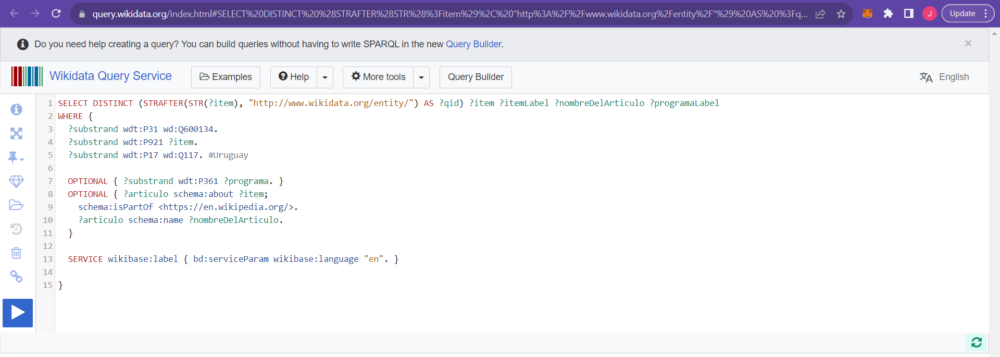
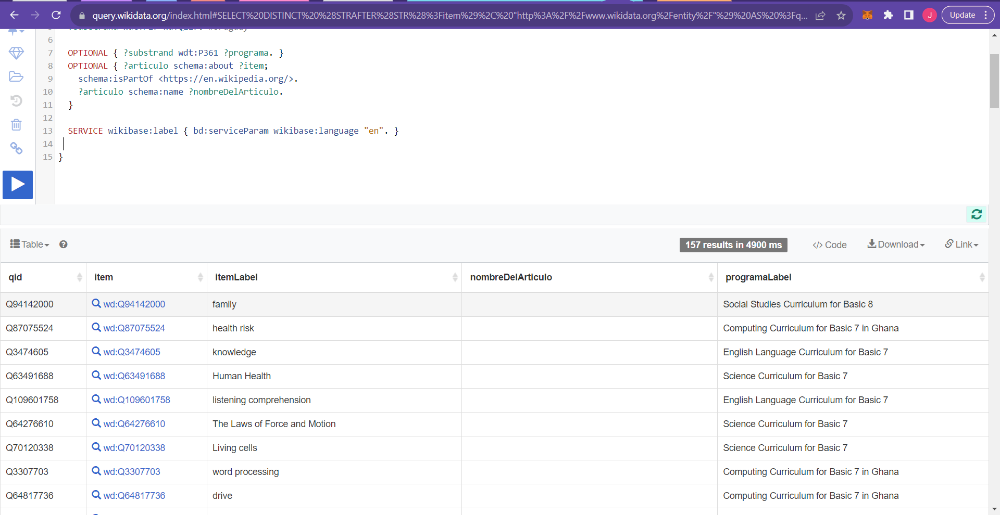
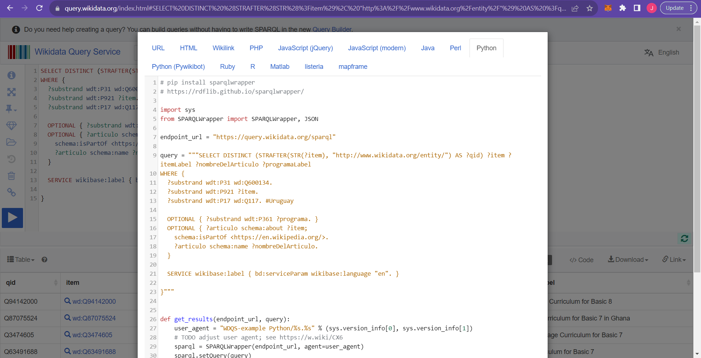

# Research: How to fetch the list of articles from Wikidata API

We want to be able to retrieve information about specific entities related to Uruguay from Wikidata and their corresponding Wikipedia article names. We'll be working with the Uruguay curriculum from the Wikidata Query Service already provided [here](https://w.wiki/7Zge).


## Building and running the Uruguay curriculum wikidata query

- When it opens up, you'll see a page as shown in the image below:
 
 This wikidata curriculum provides the SPARQL to extract structured data and the Wikidata Query needed to retrieve the specific curriculum data has already been provided. Now, you'll need to execute the query.


## Executing the query

- To execute the query, click on the 'run' button/icon on the left-hand sidebar of the page. This will retrieve and display the curriculum data in tabular format at the bottom of the page, like so:
 
 NB: Tabular format is the default format for displaying the data but it can also be displayed in other formats like Graph builder, Line chart, Bar chart, Area chart, tree map, and so on. To change the display form, click on the "Table" dropdown located at the header of the terminal the data is being displayed in. Select the format you want it displayed in.

- After executing the query and retrieving the data, you can view the code for this query in various languages. To do this, click on the "Code" text and icon located at the right-hand side of header where the curriculum data is being displayed. This will open up a modal where you'll see options to display the code in different languages like HTML, JavaScript, PHP, Java, Python, Ruby, and so on.
 
Select the 'Python' tab and copy out the full code.


## Code to fetch the articles from Wikidata API

- Create a 'main.py' file in the 'data-gathering' folder. In your main.py, paste the lines of code you copied out from the query service.
Install the SPARQLWrapper library using this command `pip install sparqlwrapper`.

- Now in your terminal, navigate to the 'data-gathering' folder by doing a `cd gathering-folder`. To run the python script, use this command: `python main.py`. This will print to the console a list of the Uruguay's curriculum. So what this code does is that it queries the Wikidata SPARQL endpoint to retrieve information about substrands in Uruguay and associated details, including program labels and article names, program labels, and then it prints the results.

- To get only the names of the articles printed out on the console, you'll need to check if the article variable name is case sensitive, then change the value of what is being printed out to the console. Refer to the 'main.py' file in the 'data-gathering' folder for the full code.


## Running the Python Code

To execute the Python code, follow these steps:

1. Open a terminal or command prompt.

2. Navigate to the project directory where the Python script is located.

3. Install the Pandas library if it's not already installed. You can use pip for this: 

`$ pip install pandas`

4. Run the 'add-grade.py' script with the following command:

`$ python add-grade.py`

This script will add the 'grade' column to the 'voci_2023.tsv' file based on the results of the SPARQL query.

##SPARQL Query

This SPARQL query retrieves unique instances of 'id_wikidata' and their corresponding 'programaLabel'.

The data is filtered based on the conditions specified in the query, such as being related to Uruguay (wd:Q77).

```sparql
SELECT DISTINCT ?id_wikidata ?programaLabel
WHERE {
  ?substrand wdt:P31 wd:Q600134.
  ?substrand wdt:P921 ?id_wikidata.
  ?substrand wdt:P17 wd:Q77. #Uruguay
  OPTIONAL { ?substrand wdt:P361 ?programa. }
  SERVICE wikibase:label { bd:serviceParam wikibase:language "es". }
}
```

Download the query to a TSV file.
